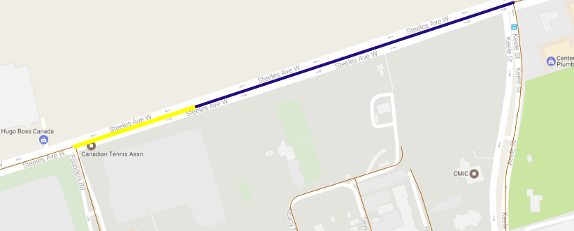

Special cases and observations during the quality control on arterycode matching are noted below.
Color schema:
magenta: arterycode geometry
red: corrected geometry
green: centreline geometry matched by algorithm

# Special cases and resolution:
Because the sources for volume counts and Toronto centreline files are different, the segments do not agree completely. Cases where discrepancies might occur and the solution the algorithm takes are presented below.

## Centreline Segments being broken up into pieces by planning boundaries, trails, etc.
arterycode|sideofint|direction|description|comment|
-----|-|----------|-------------------------------------------|----------------------------
27562/21091|S|Southbound/Northbound|SCARSDALE RD N/B(S/B) S OF YORK MILLS RD|segment broken by Leaside Rail Spur Trail and bottom segment do not pass directional alignment check
3564/1601|E/W|Westbound/Eastbound|STEELES AVE W/B E OF FOUNDERS RD/STEELES AVE E/B W OF KEELE ST|both matched to highlighted, longer segment 

Resolution: evaluate the segments containing fnode and tnode for directional alignment and will match to the segment within 20 degrees to the arterycode geometry. If both alignments are within 20 degrees, will take the longer segment. If none is within 20 degrees, the case will not be matched by nodes and will be passed on to spatial match. 

# Error Sources:
There are a few typical situations that the algorithm do not handle well. Instances caught by quality control process are corrected and labelled case 10. This is the base for further improvements to the algorithm.

## Crescents (segments share the same nodes in general)
arterycode|sideofint|direction|description|issue|
-----|-|----------|-------------------------------------------|----------------------------
20665|E|Northbound|VANLEY CRES N/B E OF CHESSWOOD DR|Chesswood Dr and Vanley Cres have the same fnode and tnode
28799/28800|E|Westbound/Eastbound|LAWRENCE NE SERVICE RD W/B E OF LAWRENCE AV|The north service road have the same fnode and tnode as the main road

## Geometry does not exist in tcl
arterycode|sideofint|direction|description|
-----|-|----------|-------------------------------------------|
11502/11503|N|Northbound/Southbound|LN E OF GILBERT AVE N/B N OF NORMAM AVE|laneway

Resolution: the centreline_id is marked null

## Curving and separated segments
arterycode|sideofint|direction|description|comment|
-----|-|----------|-------------------------------------------|----------------------------
28179/28180|N|Southbound/Northbound|FORT YORK BLVD S/B(N/B) OF FLEET ST|Segments are curved and separated therefore directional match does not align.

# Observations:
During the process, several types of inconsistencies/errors with original data are discovered and presented below. In every case, description takes higher priority than geometry. Corrections are made based on description of count locations.

## Desctiption does not match with geometry
arterycode|sideofint|direction|description|comment|
-----|-|----------|-------------------------------------------|----------------------------
3510|W|Eastbound|RESOURCES RD E/B TO ISLINGTON AVE S/B|purple segment is the arterycode geometry, which lies on Islington Ave. The description points to Resources Rd.
3526|S|Northbound|VICTORIA PARK AVE N/B TO HIGHWAY 401 W/B|arterycode geometry represents volume going to 401 W/B and through

## Wrong Description
arterycode|sideofint|direction|description|issue|
-----|-|----------|-------------------------------------------|----------------------------
23118|N|Southbound|FINCH AVE S/B N OF OLD FINCH AVE|

## Wrong Geometry
arterycode|sideofint|direction|description|comment|
-----|-|----------|-------------------------------------------|----------------------------
3823|S|Northbound|REMEMBRANCE DR N/B S OF LAKE SHORE BLVD( ONT PLACE EXISTS )|arterycode geometry is not close to anything described.

## Arterycode runs over intersections

arterycode|sideofint|direction|description|comment|
-----|-|----------|-------------------------------------------|----------------------------
34510|N|Southbound|MARKHAM RD S/B N OF PASSMORE AVE|arterycode covers the intersection of Select Ave and Markham Rd which could cause volume difference between the two stretches of the segment.

