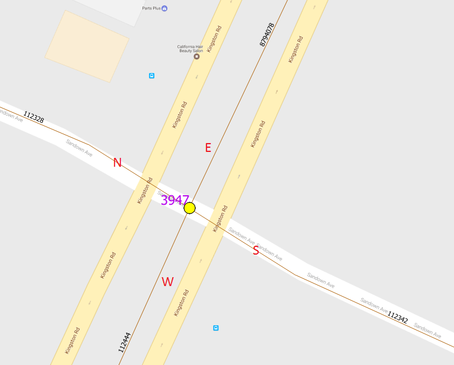
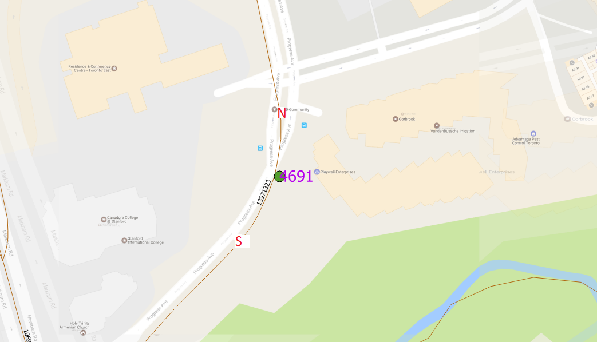
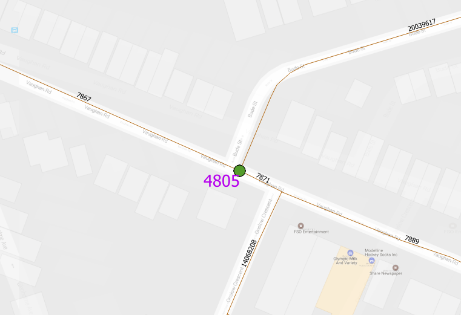

# Irregular TMC Locations 

## 1. Tilted Corridor

Although in some segments Kingston Road goes NS, Kingston Road segments are always EW. The same goes for Sheppard.

## 2. Misaligned Segments

One leg does not share the same node as the rest. This piece of information will be logged in the comments_ column.

## 3. Highways have a directional representation 

Highway 27 have a grade crossing with some roads. In these cases, Northbound N and Southbound N refer to different centreline segments that do not share the same node. 

## 4. The location is not an intersection

Some counts are done at driveways to malls and stores. N and S of the intersection will be the same segment. 
Side of intersection is calculated based on the segment (10% length from start point) and the tmc, this will cause function to return Wrong.

** A combination of the above irregularities could occur **

# Proposed QC to catch errors

1. Check the intersections with competition?
2. Check the ones that have different numbers of returned results and segments that intersect?
3. Check the comments and pull out the ones with information.
4. Check all sideofint that's 'Wrong'

# Proposed Algorithm Improvements

1. define corridors and assign directions accordingly.

# Questions
1. What to do if road segment seems misaligned, there is counts for the leg, but the comments does not say anything?

