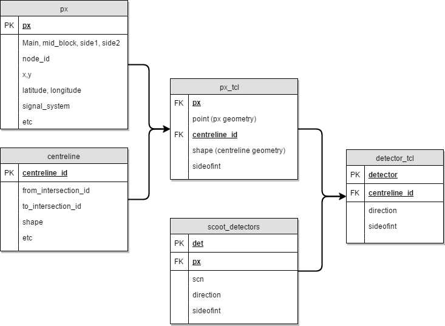

# SCOOT
Data collected from the city's signalized intersection detection system.

## Data Elements
This section gives an overview of tables stored in the database under schema SCOOT. Fields of the process tables can be found in the process diagram below.
### **Table scoot.px**
Obtained directly from the City of Toronto's [open data catalogue](http://www1.toronto.ca/wps/portal/contentonly?vgnextoid=965b868b5535b210VgnVCM1000003dd60f89RCRD&vgnextchannel=7807e03bb8d1e310VgnVCM10000071d60f89RCRD), this table stores information on every signalized intersection in the city. 
### **Table scoot.px_tcl**
This table tags all legs of an intersection to centreline segments. 
### **Table scoot.scoot_detectors**
This table stores information on SCOOT detectors in the city. The px and scn numbers in the table indicate the intersection that the detector is physically located (which can be different from the intersection that the detector's data is contributing towards). The intersection and approach that the detector is counting towards is indicated by the detector id (det).
### **Table scoot.detector_tcl**
This table contains the mapping of each SCOOT detector to the centreline segment it is located at. Exact mapping process can be found [below](# Mapping Process).
### **Tables scoot.agg_15_yyyymm**
Monthly data exported from the scoot system in 15min bins. Parent table is **scoot.scoot.scoot_agg_15_all**

|column|type|notes|
|------|----|-----|
|detector|text|in the form of N(scn #)(approach letter)(detector number) Example: N10111A1 where 10111 is intersection that detector is counting towards, A indicates the approach, and 1 means this is detector 1 of this approach.|
|start_time|timestamp||
|end_time|timestamp|start_time+15mins if count is present, but not necessarily start_time+15min if counts are missing|
|flow_mean|int|volume in **veh/h**|
|occ_mean|double precision|expressed in %|
|vehicle_occ_mean|int|ms/veh|
|lpu_factor_mean|double precision|lpu/veh|  
### **Tables scoot.cycle_level_yymmdd**
Cycle level data from the scoot system.  
### **Table video_counts**
Video counts done for SCOOT data validation.

## Mapping Process

1. Each leg of each intersection is mapped to a centreline segment based on its physical location and stored in the temporary table **px_tcl**.  
2. **px_tcl** is joined with **scoot_detectors** based on px number and side of intersection (sideofint) to map each detector to a centreline segment.

