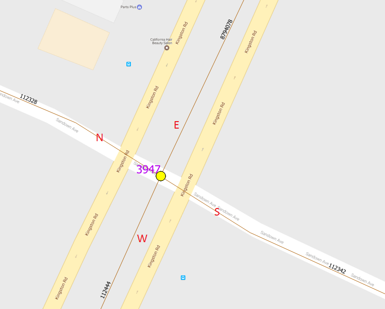
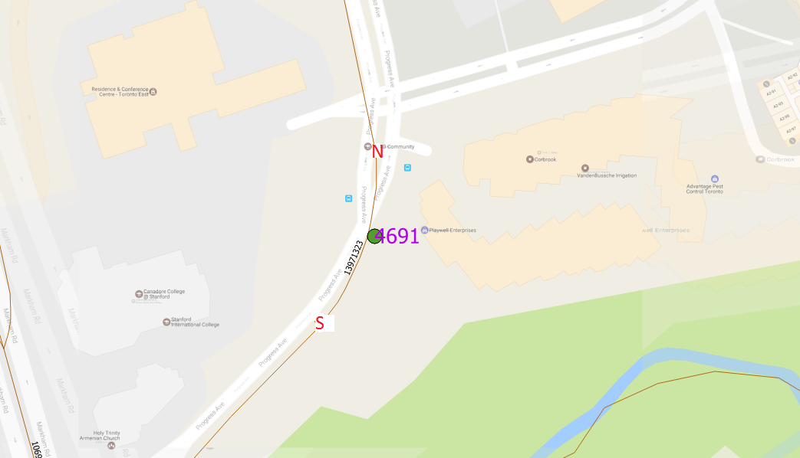

# Irregular TMC Locations 

## 1. Tilted Corridor

Although in some segments Kingston Road goes NS, Kingston Road segments are always EW. The same goes for Sheppard.

## 2. Misaligned Segments

One leg does not share the same node as the rest. This piece of information will be logged in the comments_ column.

## 3. Highways have a directional representation 

Highway 27 have a grade crossing with some roads. In these cases, Northbound N and Southbound N refer to different centreline segments that do not share the same node. 

## 4. The location is not an intersection

Some counts are done at driveways to malls and stores. N and S of the intersection will be the same segment. 
Side of intersection is calculated based on the segment (10% length from start point) and the tmc, this will cause function to return Wrong.

## 5. Wrong Geometry

Some count locations do not match its description and there are cases where exact location is given in the comment_ section of the actual count table. In the example below, the location description is BATHURST ST AT SCADDING PXO CT and comment_ states that the count in done on Bathurst just South of Dundas.

## 6. One-Way streets/ Roundabouts

** A combination of the above irregularities could occur **

# Proposed QC to catch errors

1. Check the ones that have different numbers of returned results and segments that intersect?
	164 different arterycodes
	115
2. Check the comments and pull out the ones with information.
	1468 different arterycodes
3. Check on segments that are shorter than 25m for misaligned segments.

4. all segments are same direction corridors. (Bloor/Dundas, Lawrence/Kingston)
5. roads change names at intersection. 

6. Bloor street West are separated into two directions at dundas street west.
7. O Connor Drive does not always go EW. even when it's not intersecting with a major EW corridor. so is Albion, Sheppard, Renforth
8. Transition from King st E to King st w is not recorded in corr definition/
