# Evaluating Fit to Clusters

## Metric
Take minimum of distance to average profile normalized by number of points. (distance/point)

## Results
### Distribution
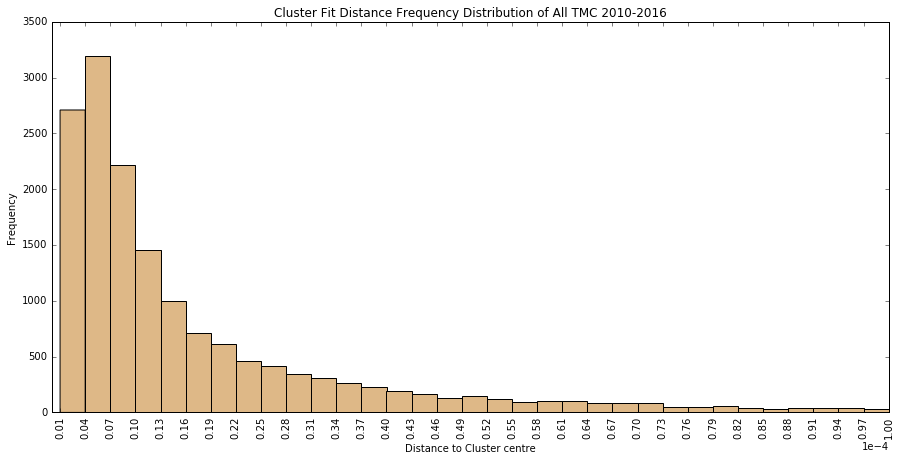
Zooming in on the highest three columns:
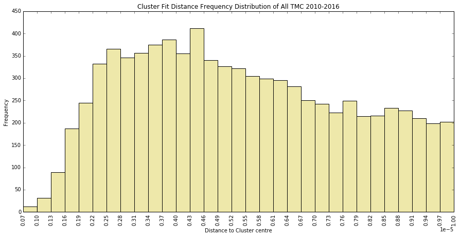
The distribution is concentrated at the lower end but the tail is long.

### Visual Validation
To make sense of the distances, a visual inspection of the profiles is shown below.
Degree of fit reduces from left to right, top to bottom.

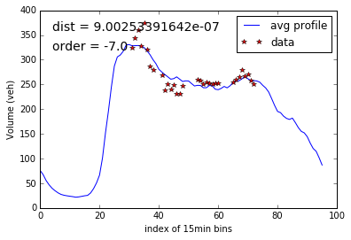
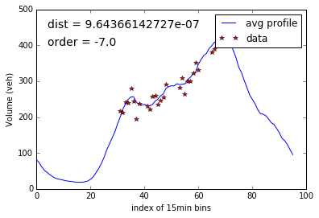
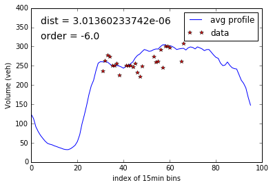
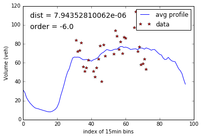
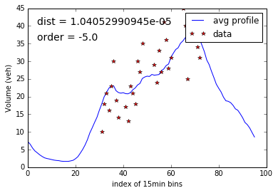
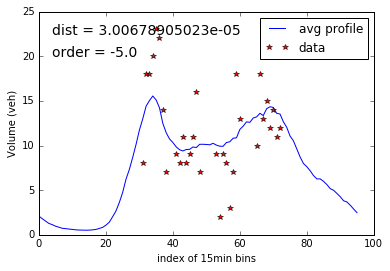
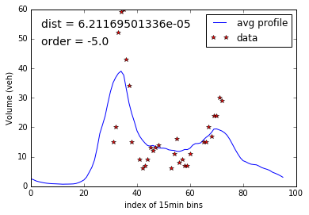
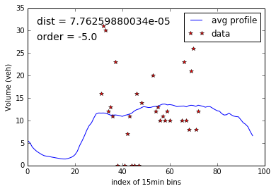
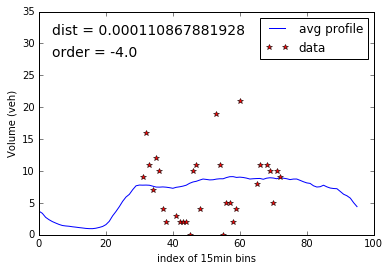
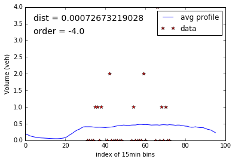
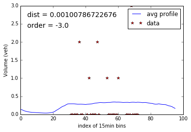

The cutoff for a good fit should be drawn somewhere on the order of -5. However, the lesser fit profiles are generally locations with very low volume and therefore highly possible to see no volume during 15min and exhibits no particular time of day trend. These generally fit to a more flat distribution. which, when calculating hourly/daily volume, will give an average of the observations, which is reasonable given the circumstances. 

## Analysis
### Distance distribution by cluster
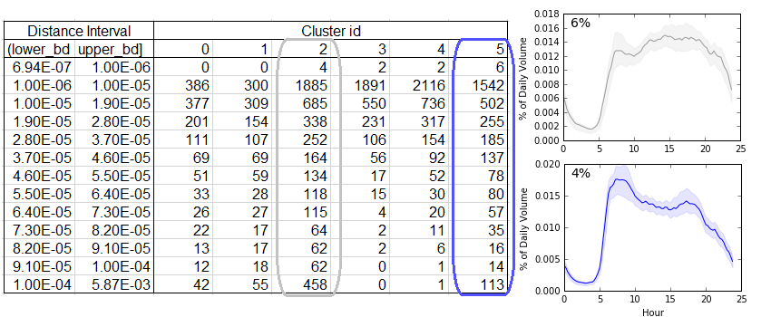

Cluster 2 (relatively consistent volume throughout the day) are generally lesser fit. Same is demonstrated in the profiles above, the lesser fit ones mostly belong to this cluster. 
Same goes for cluster 5, which also represents no particular up/down trend during the day.

### Distance distribution by road class

As expected, reliability of the clustering process decreases as total volume decreases because of
1. lack of pattern on roads with less volume
2. counts are more susceptible to random errors. 

### Percent Difference between Min and Second Min
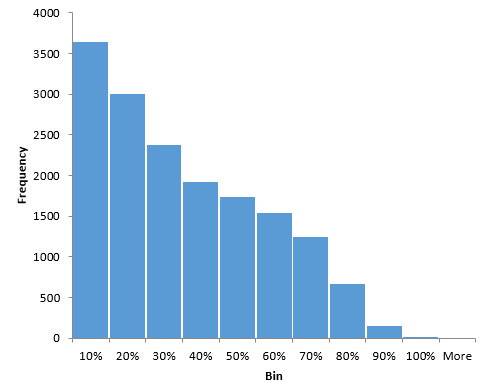

Below are examples in the first bin, middle bin, and last bin, respectively.  
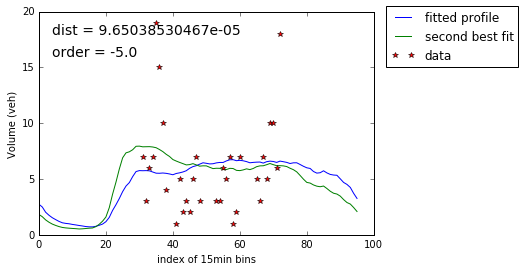
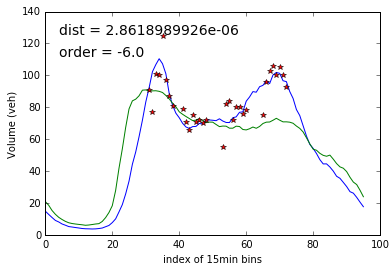
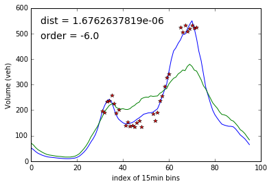

Ideally, the percent difference should be close to 1. However, the plots suggest that
1. at least two of our cluster centres should quite similar
2. some of the data is messy.
