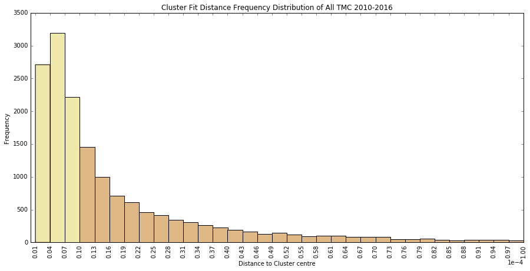
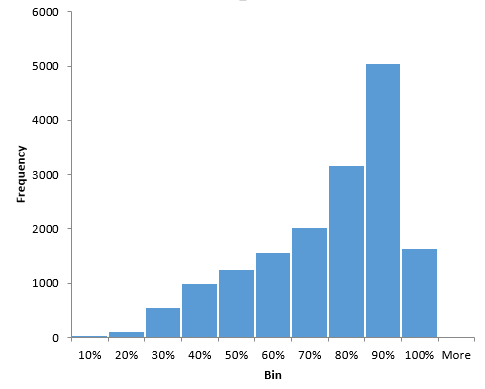

# Evaluating Fit to Clusters

## Metric
Take minimum of distance to average profile normalized by number of points. (distance/point)

## Results
### Distribution

The distribution is concentrated at the lower end but the tail is long.

### Visual Validation
To make sense of the distances, a visual inspection of the profiles is shown below.
Degree of fit reduces from left to right, top to bottom.

The cutoff for a good fit should be drawn somewhere on the order of -5. However, the lesser fit profiles are generally locations with very low volume and therefore highly possible to see no volume during 15min and exhibits no particular time of day trend. These generally fit to a more flat distribution. which, when calculating hourly/daily volume, will give an average of the observations, which is reasonable given the circumstances. 

## Analysis
### Distance distribution by cluster

Cluster 2 (relatively consistent volume throughout the day) are generally lesser fit. Same is demonstrated in the profiles above, the lesser fit ones mostly belong to this cluster. 
Same goes for cluster 5, which also represents no particular up/down trend during the day.

### Percent Difference between Min and Second Min

Ideally, the percent difference should be close to 1. However, this plot suggests that at least two of our cluster centres should quite similar. 

### Percent Difference between Min and Average without Min

The result here shows that the min distance is generally very different compared to the rest of clusters.