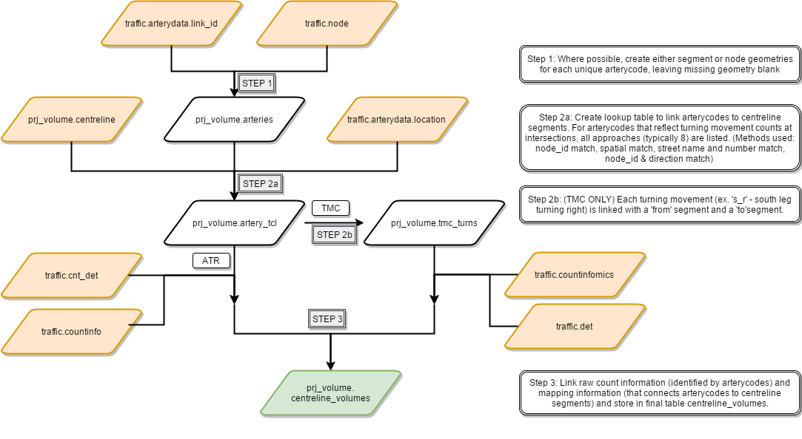

This document provides an overview of the methodology for mapping raw turning movement count (TMC) and automatic traffic recorder (ATR) count data to the [City of Toronto's Centreline](http://www1.toronto.ca/wps/portal/contentonly?vgnextoid=9acb5f9cd70bb210VgnVCM1000003dd60f89RCRD) segments.

## Process
The following diagram outlines the process for transforming raw TMC and ATR data mapped to the City's current node and segment geographic system, FLOW, to a single table consisting of all count data mapped to the City's centreline system.
Color Schema:  
 - **Orange**: Original tables from FLOW, consisting of raw count and geometry data.
 - **White**: Intermediate tables used for processing and transforming the data.
 - **Green**: The final table, consisting of processed count data mapped to the City's centreline system.

## Table content: centreline_volumes
Field Name|Type|Description
:----------:|:----:|-----------
volume_id|integer sequence|serial assigned to each volume count record
centreline_id|integer|FK to Table Centreline
dir_bin|integer|-1 if angle between start and end point of a segment (after correcting for 16.7 degrees) is between 135 and 315 degrees; +1 otherwise
count_bin|timestamp|date and time of the count
volume|integer|volume 
count_type|integer|1 for ATR counts, 2 for TMC counts
