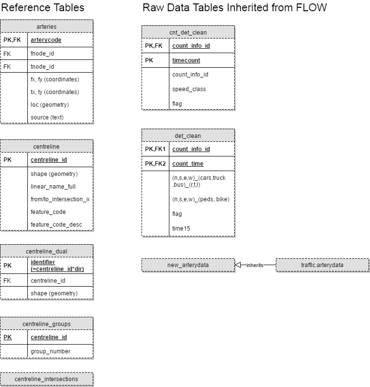
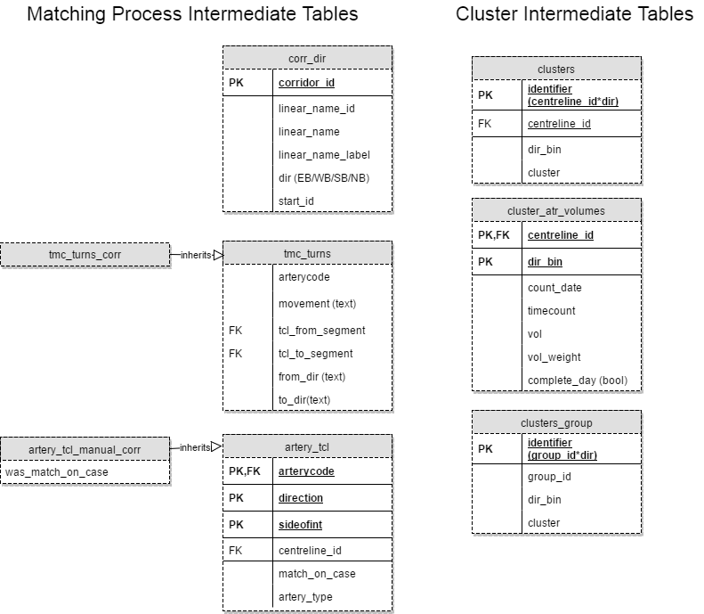

# Schema prj_volume Overview and Breakdown
## Tables
There are three categories of tables in the schema:
1. Reference/Raw Tables

|Table Name|Description|Notes|
|----------|-----------|-----|
|arteries|geometry information for arterycodes|source indicates the source of coordinate information (geocoding, flow, centreline, null)|
|centreline|Toronto centreline||
|centreline_dual|dual of the centreline table with the addition of directions|used for mapping 2-way volume|
|centreline_groups|grouping of centrelines sharing the same volume|merging segments on the same street with no intersecting collector and above|
|centreline_groups_geom|geometry of grouped centrelines and additional information such as road class and street name|a few circular geometries simplified to half circles|
|centreline_groups_l2|level 2 grouping of the centreline groups|merging segments on the same street with no intersecting minor arterial and above (excl. expressways since they are not at grade crossing)|
|centreline_intersections|intersections in Toronto||
|cnt_det_clean|ATR counts in flow|clean version of traffic.cnt_det, with bad records deleted or flagged|
|det_clean|TMC counts in flow|clean version of traffic.det, with bad records deleted or flagged|
|new_arterydata|new/modified arterycodes||
|monthly_factors|seasonal factors (weights) for each month|average factors are identified by centreline_id = dir_bin = 0|
|monthly_factors_group|seasonal factors w.r.t. centreline_groups|average factors are identified by group_number = dir_bin = 0|

2. Intermediate Tables

|Table Name|Description|Notes|
|----------|-----------|-----|
|corr_dir|major corridor definition||
|tmc_turns|a table that links vehicle movement with centrelines|movement text corresponds to the columns in det/det_clean|
|actery_tcl|a table that links arterycodes (both ATR and TMC) to centrelines||
|clusters|cluster results||
|cluster_profiles|the representative profiles of each cluster||
|cluster_atr_volumes|volumes used for clustering|vol_weight is null for incomplete day counts indicated by the field complete_day|
|clusters_group|cluster results w.r.t. centreline groups||

3. Volume Tables

|Table Name|Description|Notes|
|----------|-----------|-----|
|centreline_volumes|ultimate volumes table|one entry for one location, datetime, type, and class|
|atr_daily_summary|daily atr volumes|from 2009-2016, aggregated complete-day data from centreline_volumes|
|tmc_daily_summary|daily tmc volumes|from 2009-2016, aggregated complete-day data from centreline_volumes|
|aadt|Annual Average Daily Traffic (weekdays only)|confidence: 1 - counts available; 2-4 - spatially extrapolated (see [link](/volume_project/spatial_extrapolation/README.md))|

