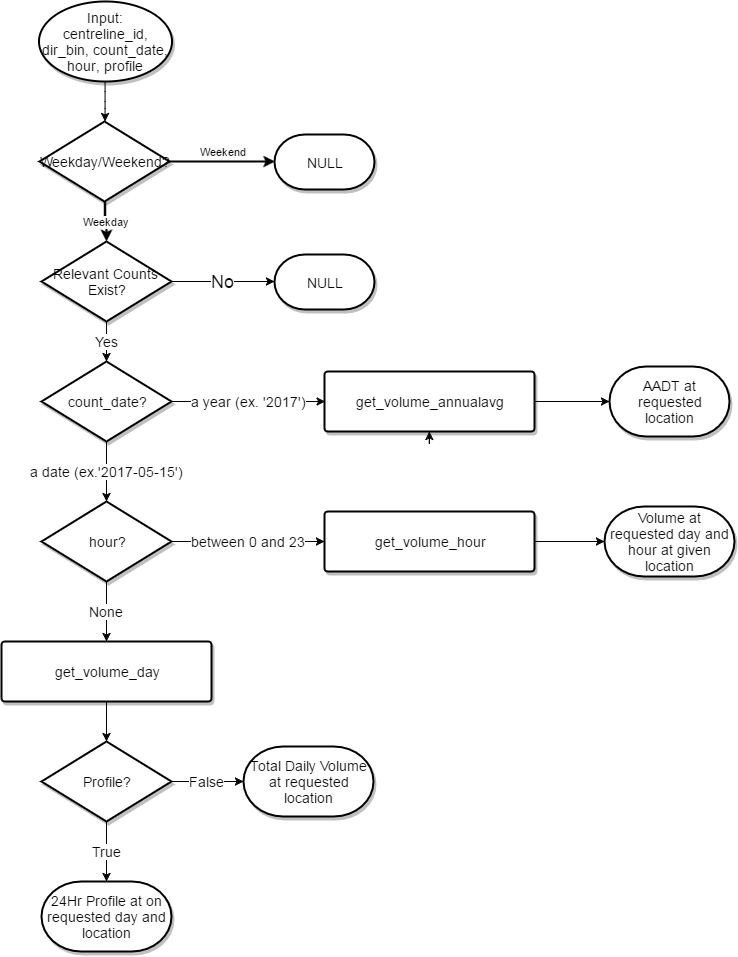
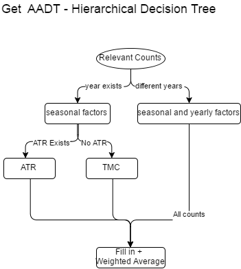
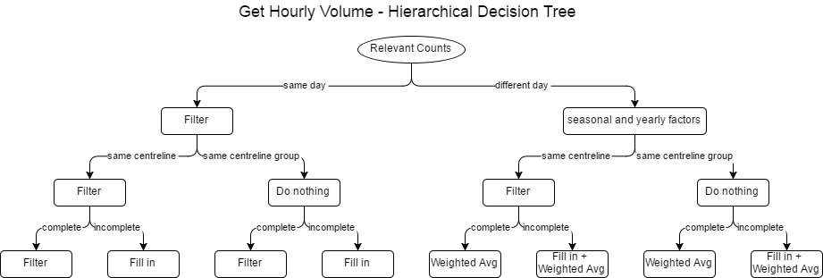

# Volume Count Extraction and Estimation (Factor-based)

Extract volume counts wherever possible and estimate volumes based on spatial relationships and temporal (TOD, seasonal, yearly) factors.

## Functions:
### Skeleton Functions
* get_volume(db, profiles, centreline_id, dir_bin, date, hour=None, profile=False)

* get_volume_annualavg(db, tmc, atr, profiles, centreline_id, dir_bin, year)

* get_volume_day(db, tmc, atr, profiles, centreline_id, dir_bin, date)
* get_volume_hour(db, tmc, atr, profiles, centreline_id, dir_bin, date, hour)  

### Utility functions
* calc_date_factors(date, dates, centreline_id, dir_bin)
  - Monthly Factor: Applied when the requested location is counted in another month. Relative weights of each month compared to the average. Only locations with counts in all month of a year is used. If the location and year requested were not counted, an average profile derived from all locations is used.
  - Yearly Weights: Applied when the count is >5 years away from the requested date because of the decreased relativity. When absolute year difference is less than 5, weight = 1; from the sixth year, the weight linearly decreases to 0.5 (weight for the most distant year). Volumes are calculated based on these normalized weightings.
* fill_in(profiles, records, hour=None)
  - Utilize clustering information to fill in the TOD profile. If the location is classified before with complete-day counts, the fill-in procedure will use the profile identified there. If the location does not have a complete-day count classification, profile will be classified based on the incomplete counts. 
* get_relevant_counts(db, centreline_id, dir_bin)
  - Retrieve all relevant counts from the database: same centreline group, any time.
* slice_data(df1, df2, centreline_id=None, count_date=None, hour=None)
  - Slice data based on the criteria passed in. 
  - If all optional arguments are omitted, the originals will be returned. 
* take_weighted_average(tmc, atr, agglvl, factors_date=None)
  - Take weighted average of the counts. 
  - If factors are omitted, a normal average will be taken.
 

### Improvements
* More robust yearly weights calculation.
* Spatial interpolation based on neighbour links.
