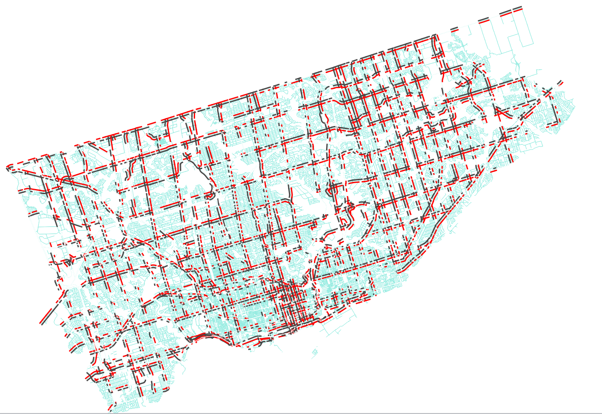
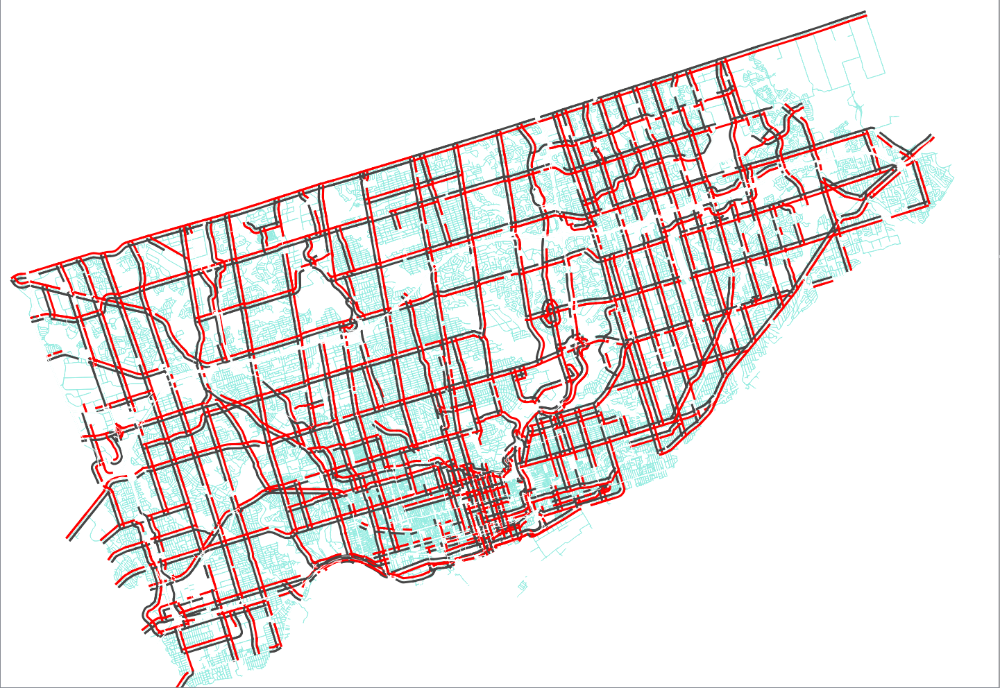

# Spatial Interpolation

## Purpose

Centrelines break whenever there's an intersecting segment, whether the intersecting segment is planning boundary, railroad, or walkway. A group of centrelines could share the same volume. In order to get a true estimate of the coverage of our counts and to infer counts for segments that are not explicitly matched to counts, we group centrelines that share the same volume.

## Methodology

1. Create a function determining whether two centrelines share the same volume [create_function_same_volume.sql](create_function_same_volume.sql)
	If the two centrelines share a node and the other segments intersecting the same node is local or below, the two centrelines are considered to have the same volume.
2. Create a truth table of all road centreline and direction pairs and determine if they share the same volume [find_same_volume_segments.sql](find_same_volume_segments.sql)
3. Pass the table created in Step 2 to a depth-first-search algorithm to mine for connected groups on the graph [group_centrelines.py](group_centrelines.py)

## Results
The result is stored in table prj_volume.centreline_groups which maps each road centreline_id and dir_bin to a group number.

Count coverage on arterials and expressways in Toronto before merging:

Count coverage on arterials and expressways in Toronto after merging:
