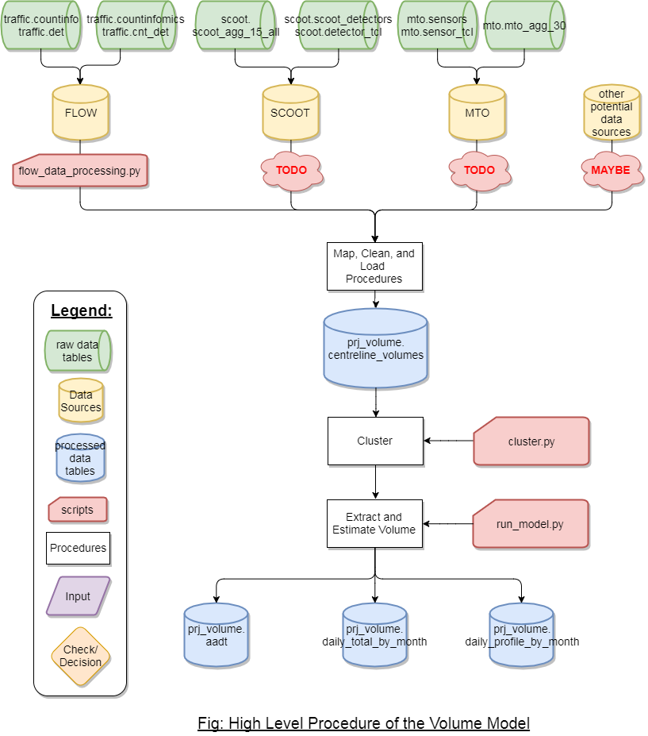

# Traffic Volumes Modelling Project
This repository contains the scripts for and data tables needed to get from FLOW datatables to a complete volume map based on the Toronto centreline. 

## 1. Purpose
Develop a methodology for estimating traffic volumes on road segments in the City of Toronto.

## 2. Data Tables and Preprocessing

### 2.1 FLOW (traffic schema)
Tables in the traffic schema should be up-to-date by running scipts in [update_db](preprocessing/update_db/). Required tables are traffic.cnt_det, traffic.det, traffic.countinfo, traffic.countinfomics.

### 2.2 Centreline 
Table prj_volume.centreline should be up-to-date. 

### 2.3 Preprocessing
The procedures outlined below do not need to be refreshed whenever new data come in. They only need to be refreshed once the centreline table gets updated.
#### 2.3.1 [Corridor Definition](preprocessing/corridors/)
Corridors should be defined and stored in prj_volume.corr_dir

#### 2.3.2 [Centreline Grouping](preprocessing/spatial_interpolation)
Groups centrelines and directions that share the same volume and assign a unique group_number. 

## 3. Functionality
Based on the new information, some or all of the functions below should be re-run from the master script [run.py](run.py). Detailed description about each procedure can be found under the linked folders. 

### 3.1 [Arterycode Matching](arterycode_mapping/)
### 3.2 [Clean up Counts](data_cleanup/)
### 3.3 [Populate Volume Tables](populate_datatables/)
### 3.4 [Clustering](clustering/)
### 3.5 [Estimate Volumes (Temporal Extrapolation)](estimation_extraction/)
### 3.6 [Estimate Volumes (Spatial Extrapolation)](spatial_extrapolation/)

## 4. Usage 
The model is divided into 2 parts, data processing and estimation. The flowchart below depicts the high-level process. 

Note that the legend here applies to other flowcharts in the subfolders as well.

The table prj_volume.centreline_volumes bridges the two procedures together. The script [data_processing_flow.py](data_processing_flow.py) starts with the tables in traffic and outputs results to prj_volume.centreline_volumes. No parameters are required to run the script. When there are new sources coming in, they should be populating `prj_volume.centreline_volumes`. Note that the table does not allow duplicate entries. A merging algorithm needs to be developed when new data sources that potentially overlap with existing data. 

The script [run_model.py](run_model.py) starts with the table `prj_volume.centreline_volumes`, and proceeds to populate the aadt table, daily totals table, or the daily profiles table based on parameters given.   

1. (2.1) Clustering is optional. If there is no update to centreline_volumes table. There's no need to refresh clustering. 
2. (2.2) Including incomplete day counts in clustering results is optional. If so, the set variable include_incomplete to True. If True, incomplete day cluster results will be uploaded to database. When there are multiple days at one location, the mode will be chosen. If False, count estimation program will cluster if needed and the clustered profile will be based on only the relevant counts (relevant to the estimation)
3. (3) Temporal extrapolation instance initialization. (centreline_id/group_number)
3. (3.1) Refreshing monthly factors is optional. If there is no update to the centreline_volumes table. There's no need to refresh monthly factors.
4. (3.2) Three parameters in fill in data: start_number, year, freq
	- start_number: default = 0; **index** of start centreline_id/group_number. Does not translate to actual centreline_id or group_number. Set to other values when procedure got interrupted by error or connection drop so that no work is duplicated.
	- year: the year of interest
	- freq: one of 'year', 'day', 'hour'
		* 'year': Will calculate annual average weekdays daily volume and store in prj_volume.aadt.
		* 'day': Will calculate average weekday daily total volume for each month in the given year and upload to prj_volume.daily_total_by_month.
		* 'hour': Will calculate average weekday daily volume profiles for each month in the given year and upload to prj_volume.daily_profile_by_month. 
