Special cases and observations during the quality control on arterycode matching are noted below.  
**Color scheme:**    
Magenta: arterycode geometry  
Red: corrected geometry  
Green: centreline geometry matched by algorithm  

# Special cases and resolution:
Because the sources for volume counts and Toronto centreline files are different, the segments do not agree completely. Cases where discrepancies might occur and the solution the algorithm takes are presented below.

## 1. Centreline Segments being broken up by planning boundaries, trails, etc.
arterycode|sideofint|direction|description|comment
----------|---------|---------|-----------|-------
27562/21091|S|Southbound/Northbound|SCARSDALE RD N/B(S/B) S OF YORK MILLS RD|segment broken by Leaside Rail Spur Trail and bottom segment do not pass directional alignment check
3564/1601|E/W|Westbound/Eastbound|STEELES AVE W/B E OF FOUNDERS RD/STEELES AVE E/B W OF KEELE ST|both matched to the longer segment 

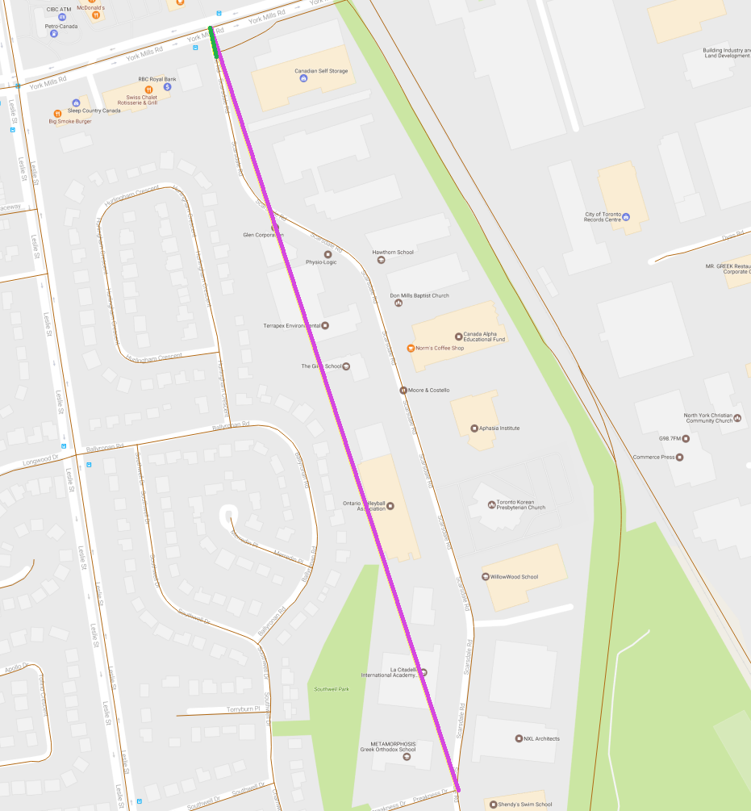
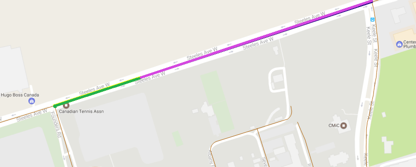

Resolution: Depending on the case that the arterycode is matched on. The arterycode might be mapped to the centreline segment that shares a node with the arterycode geometry and has a longer length, or the centreline segment that is closer to the segment by Hausdorff Distance. While checking, the rule of thumb used is that if the centreline segments that make up the arterycode geometry is broken up by planning boundary, trails, geostatistical lines, i.e. no vehicular flow will be diverted/merged in and volume stays constant across, the match will be considered correct.

# Error Sources:
There are a few representative situations that the algorithm do not handle well. Instances caught by quality control are corrected and labelled case 10. This is the base for further improvements to the matching algorithm.

## 1. Crescents (segments share the same nodes in general)
arterycode|sideofint|direction|description|comment
----------|---------|---------|-----------|-------
20665|E|Northbound|VANLEY CRES N/B E OF CHESSWOOD DR|Chesswood Dr and Vanley Cres have the same fnode and tnode
28799/28800|E|Westbound/Eastbound|LAWRENCE NE SERVICE RD W/B E OF LAWRENCE AV|The north service road have the same fnode and tnode as the main road

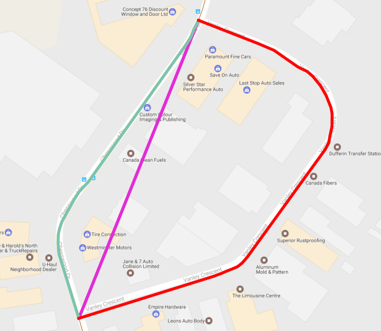
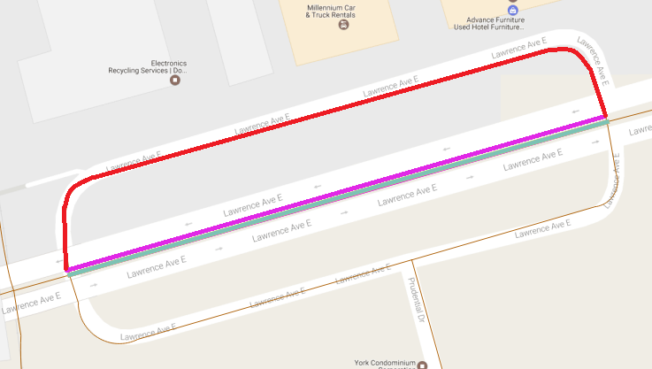

## 2. Geometry does not exist in tcl
arterycode|sideofint|direction|description|comment
----------|---------|---------|-----------|-------
11502/11503|N|Northbound/Southbound|LN E OF GILBERT AVE N/B N OF NORMAM AVE|laneway

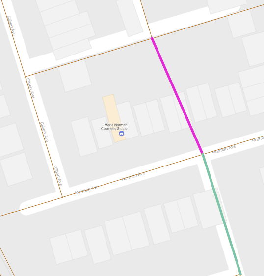

Resolution: centreline_id is marked null

## 3. Curving and separated segments
arterycode|sideofint|direction|description|comment
----------|---------|---------|-----------|-------
28179/28180|N|Southbound/Northbound|FORT YORK BLVD S/B(N/B) OF FLEET ST|Segments are curved and separated therefore directional match does not align.

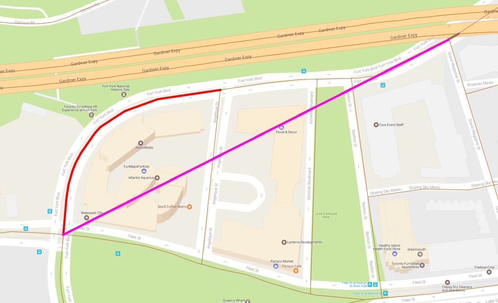

## 4. Geometry lies outside of Toronto centreline boundary
arterycode|sideofint|direction|description|comment
----------|---------|---------|-----------|-------
22873|W|Eastbound|THE QUEENSWAY E/B W OF ETOBICOKE CREEK|

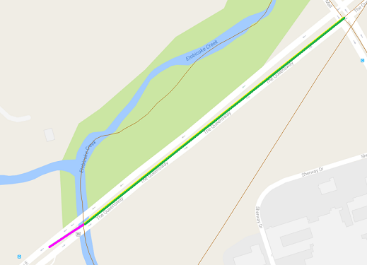

Resolution: centreline_id is marked null

## 5. Ambiguous Direction + Incomplete Geometry
arterycode|sideofint|direction|description|comment
----------|---------|---------|-----------|-------
37583/37584|S|Northbound/Southbound|KIDBROOKE CRES N/B(S/B) S OF GIDLEY RD|only one point available for this arterycode. while overall Kidbrooke Cres is south of Gidley Rd, directly south of Gidley Rd Kidbrooke Cres goes east

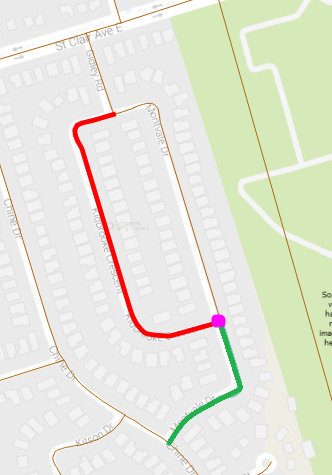

## 6. Highway Ramps + Incomplete/Inaccurate/Segmented Geometry
arterycode|sideofint|direction|description|comment
----------|---------|---------|-----------|-------
1247|S|Northbound|ISLINGTON AVE N/B TO HIGHWAY 401 E/B|there are a lot of segments near the ramp. without accurate start/end point information, the algorithm performs by luck. in this case, the segment is matched to ISLINGTON S/B TO 401 E/B RAMP.

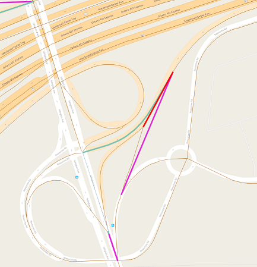

# Observations:
During the process, several types of inconsistencies/errors with original data are discovered and presented below. In every case, description takes higher priority than geometry. Corrections are made based on description of count locations.

## 1. Description does not match with geometry
arterycode|sideofint|direction|description|comment
----------|---------|---------|-----------|-------
3510|W|Eastbound|RESOURCES RD E/B TO ISLINGTON AVE S/B|purple segment is the arterycode geometry, which lies on Islington Ave. The description points to Resources Rd.
3526|S|Northbound|VICTORIA PARK AVE N/B TO HIGHWAY 401 W/B|arterycode geometry represents volume going to 401 W/B and through

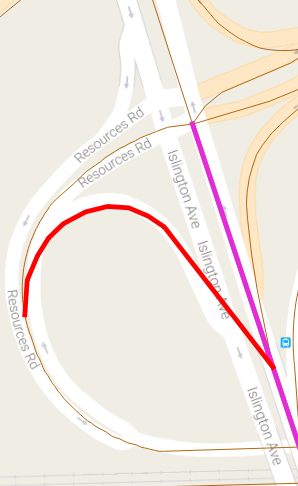
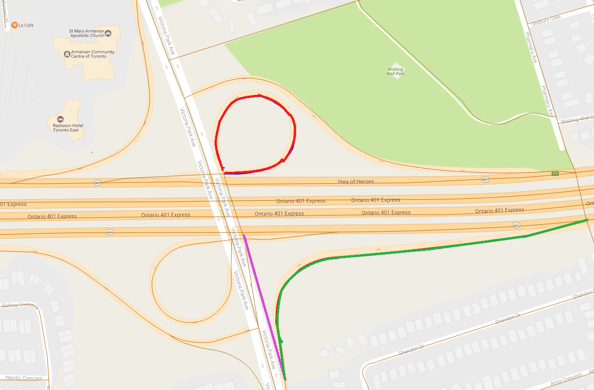

## 2. Wrong Description
arterycode|sideofint|direction|description|comment
----------|---------|---------|-----------|-------
23118|N|Southbound|FINCH AVE S/B N OF OLD FINCH AVE|Finch Ave is not connected with Old Finch Ave and geometry lies on Morningside Ave.
23006/23008|S|Northbound/Southbound|KENNETH AVE N/B(S/B) S OF FINCH AVE|Kenneth Ave continues as Doris Ave South of Finch Ave

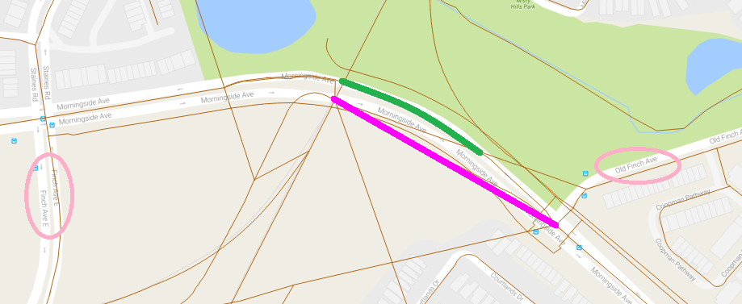
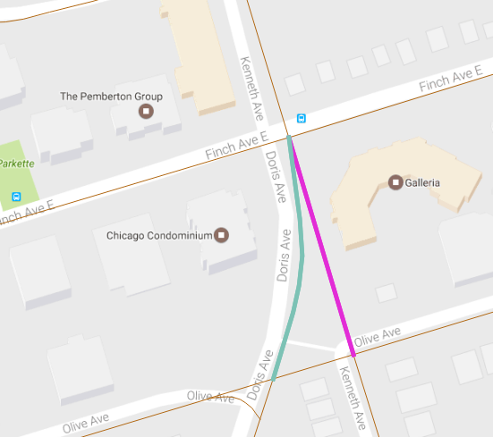

## 3. Wrong Geometry  
arterycode|sideofint|direction|description|comment
----------|---------|---------|-----------|-------
3823|S|Northbound|REMEMBRANCE DR N/B S OF LAKE SHORE BLVD( ONT PLACE EXISTS )|arterycode geometry is not close to anything described.

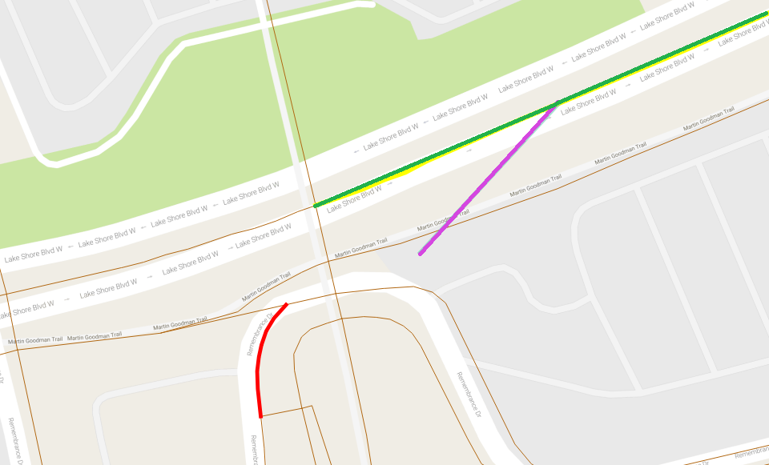

## 4. Arterycode runs over intersections  
arterycode|sideofint|direction|description|comment
----------|---------|---------|-----------|-------
34510|N|Southbound|MARKHAM RD S/B N OF PASSMORE AVE|arterycode covers the intersection of Select Ave and Markham Rd which could cause volume difference between the two stretches of the segment.

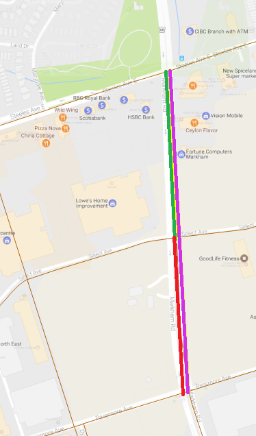

## 5. Wrong Geometry Direction
In FLOW, the from and to relationship of segments are not always correct. There are 3 sources of information, geometry, text, and one-way street information from the centreline file. 

Resolution: 
1. (text = geometry) != oneway_direction -> discard count
2. text = oneway_direction OR two_way_street -> reverse geometry
3. (geometry = oneway_direction) != text -> reverse text 
