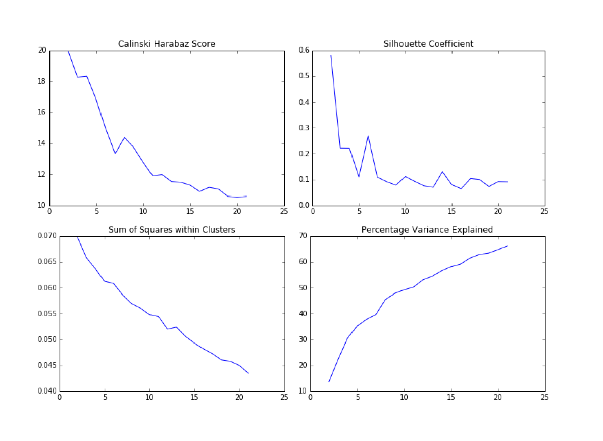
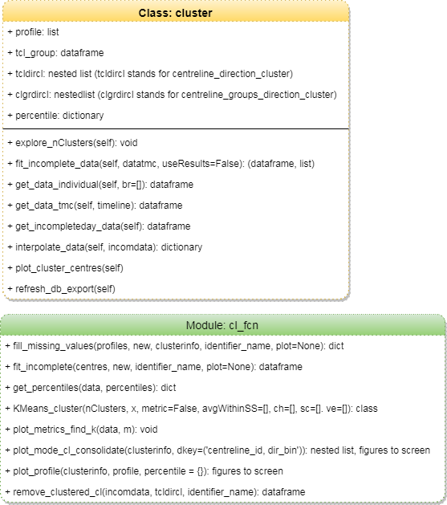
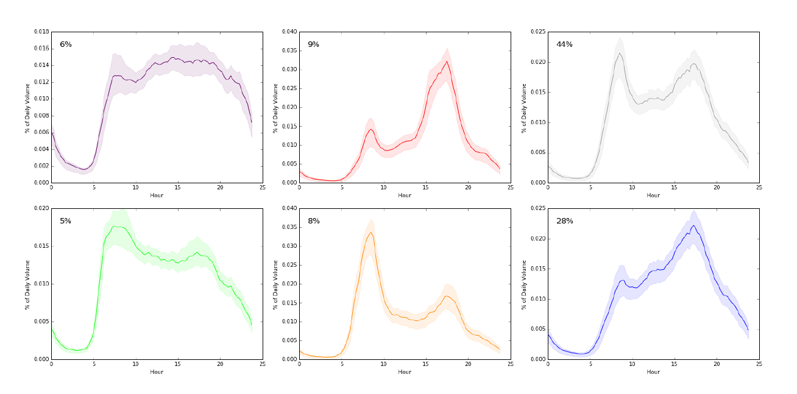
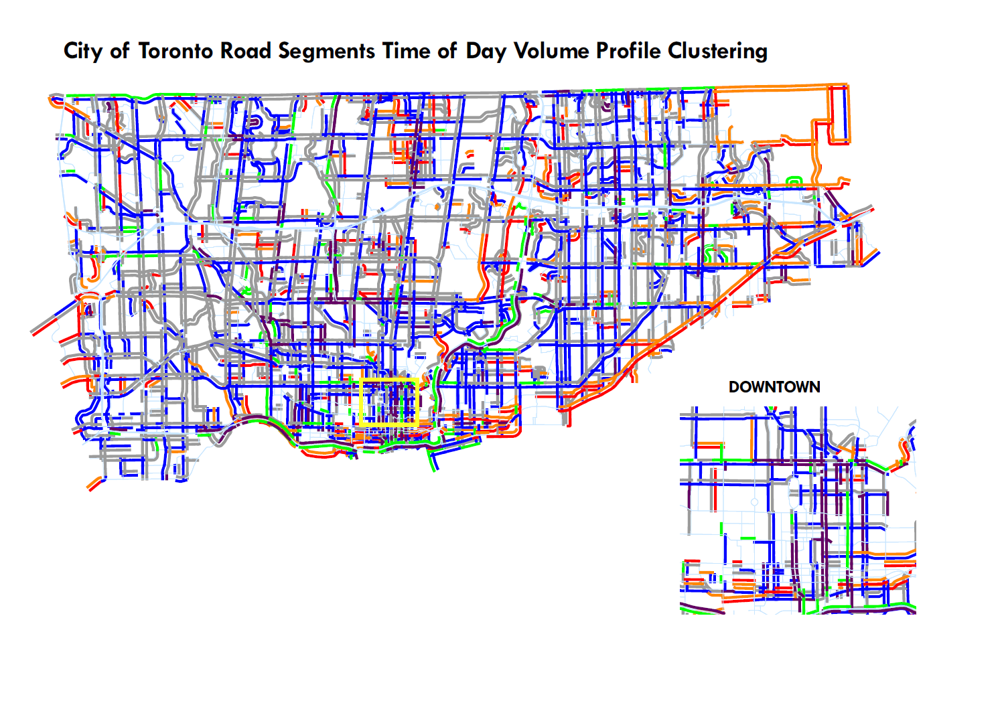

# Clustering

## Purpose
Volume data from all data sources has gaps, which could be a missing count or a period of missing counts. We hope to fill these gaps by clustering time-of-day profiles and assign each location (centreline_id, direction) to a profile.

## Methodology
1. **KMeans training and metrics**  
	Use complete day data to train KMeans model from scikit-learn and experiment with different numbers of clusters and evaluation metrics
	Four metrics were plotted below: 
	
	The data is really messy and the metrics are not very suggestive. The Silhouette coefficient weakly suggested 6 and some work was done around that - profiles were plotted and compared with each other to see if increase/decrease in cluster numbers can be justified. In the end, 6 was the number chosen.
2. **Classify complete-day data**  
	The predict method in KMeans was used to classify each TOD profile to clusters. Most locations are counted on multiple days, and they do not necessarily belong to the same cluster due to noise. Cluster results are grouped by location and the mode cluster id is assigned.
3. **Classify incomplete-day data (All TMC + Some ATR)**  
	1. Check if the location has been classified already. 
		If complete-day data exists for a particular location, it is treated as the source of truth and incomplete-day data will not be used towards clustering. 
	2. If the location does not have complete-day data (as do many TMCs), distance to each established cluster centre is calculated. The profile is then assigned to the closest cluster centre. 

## Implementation
The algorithm is implemented with a class and a module in python. The figure below illustrates the attributes and methods. For detailed information on respective methods, please look for the docstrings of the methods in [cluster.py](cluster.py) and [cl_fcn.py](cl_fcn.py).

## Results
The result of this exercise is a lookup table of location and cluster ids and a list of cluster centre profiles to be fed into extract+estimate phase of volume reporting. 
Based on existing counts, the six cluster centres are shown below:

* Percentage shown is the percent share of segments that belong to this cluster among all segments.
* The bands represent 25% and 95% percentile of the profiles.

The distribution of profiles is shown below:

* The colour of the plots corresponds to the colours shown on the map.
* Only collector and above is shown on the map.

## Evaluation of Fit
To understand how well the clusters centres represent the counts, a detailed analysis on the goodness of fit using turning movement counts can be found at [Fit Evaluation.md](Evaluation_fit.md)

## Potential Improvements

* Create custom weighted clustering profiles when more than 1 behaviour are present at one location. (Issue #38)
* Allowing multiple profiles to exist for one location over the years as travel patterns change.
* Improve the procedure for assigning incomplete day counts as the patterns are not reliable when < 50% of the time bins are filled by actual counts (Issue #39)

