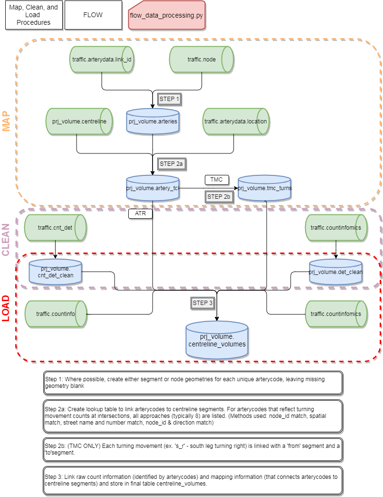

# Traffic Count Volume Data - Processing and Use

This document provides an overview of the methodology for mapping raw turning movement count (TMC) and automatic traffic recorder (ATR) count data to the [City of Toronto's Centreline](http://www1.toronto.ca/wps/portal/contentonly?vgnextoid=9acb5f9cd70bb210VgnVCM1000003dd60f89RCRD) segments. 

#### Related Links
- [Documentation of raw volume tables in FLOW](https://github.com/CityofToronto/bdit_data-sources/tree/master/volumes)
- [An overview of the Traffic Vehicle Count Project](https://github.com/CityofToronto/bdit_volumes)

## Process
The following diagram outlines the process for transforming raw TMC and ATR data mapped to the City's current node and segment geographic system, FLOW, to a single table consisting of all count data mapped to the City's centreline system. The final dataset housing all ATR and TMC data fully mapped to the City's centreline system is stored in `centreline_volumes`.

Mapping ATR counts involves linking FLOW segments to centreline segments on a one-to-one basis. Artery codes are linked to centreline segments via an intermediate table, `artery_tcl`, which is then used to process and insert raw count data into `centreline_volumes`.

TMCs, on the other hand, consist of volumes across multiple links at a specific intersection. This necessitates the creation of an additional intermediate table, `tmc_turns`, to identify the centreline segments which correspond to all the various legs (typically 8) of a specific intersection and their relative location (i.e. N, S, E, or W) and direction (NB, SB, EB, or WB).

Detailed description of Step 1 (geometry matching) can be found in [artery_matching](arterycode_matching/) and scripts to create tables that link the movements can be found in this folder.

Color Schema:  
 - **Orange**: Original tables from FLOW, consisting of raw count and geometry data.
 - **White**: Intermediate tables used for processing and transforming the data.
 - **Green**: The final table, consisting of processed count data mapped to the City's centreline system.

## Grid Angle Correction
The City of Toronto's road network approximates a traditional grid system, with most major streets generally being classified as either east-west or north-south. The orientation of this grid, however, deviates from "true north" by approximately 16.7 degrees. As a result, the processes and/or fields related to the direction of counts or segments are first re-oriented by +16.7 degrees prior to processing.

As centrelines are non-directional segments (as opposed to vehicle counts which *are* directional), just mapping count data to centrelines is insufficient; the addition of a second field (`dir_bin`) indicating direction of travel is imperative to future mapping and modelling exercises. This field is either set to **1** (reflecting segment angles of -45° to +135°, or roughly **north** and **east**) or **-1** (reflecting segment angles of +135° to +315°, or roughly **south** and **west**). This was done to allow future analysts to determine the direction of travel along a centreline without reliance on the digitization of the segment itself.

## Data Dictionary
#### centreline_volumes
Field Name|Type|Description
:----------:|:----:|-----------
volume_id|serial|autoincrementing integer assigned to each unique count record
centreline_id|integer|foreign key to `centreline`
dir_bin|integer|quasi-binary value (-1 or 1) indicating direction of count (see #Grid-Angle-Correction)
count_bin|timestamp|start date and time of bin for vehicle count (typically 15 minutes)
volume|integer|total vehicle throughput on segment during time bin
count_type|integer|1 for ATR, 2 for TMC
speed_class|integer|(optional) speed bin number the count falls into (1-14), if this is not a speed count, the field will be NULL/0.  

* Weekend counts are not filtered at this step.

## Spatial Count Availability 2010-2016
### ATR

### TMC

