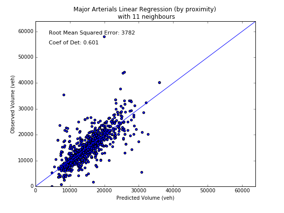
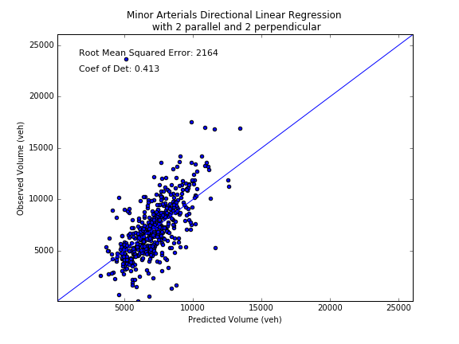
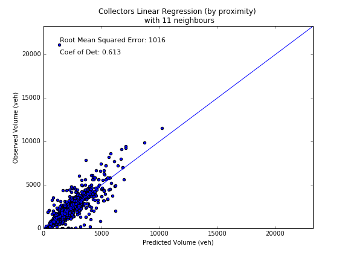
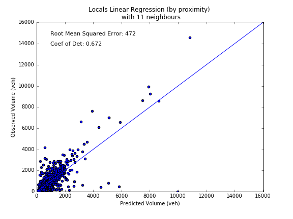
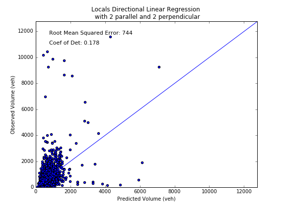
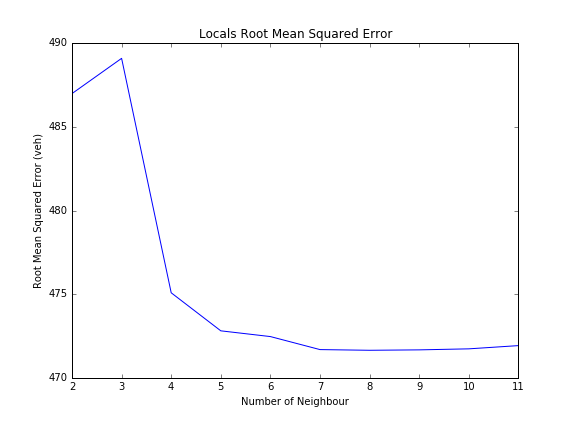

# Spatial Extrapolation

## Purpose
To fill in gaps in the City of Toronto's count program in order to provide a complete picture of volumes across the entire city.

## Methodology
Several methods are tested for this purpose and are detailed below.

1. Average of Nearest Neighbours  (confidence code = 3)
nearest neighbours: 5 (or less) segments of the same road class that are maximum 300m (nearest point to point distance) away from the target segment

2. Linear Regression (Based on Proximity only)  (confidence code = 4)
Take the volumes of the nearest 5 segments of the same road class as dependent variables (ordered by proximity).

3. Linear Regression (Directional)  (confidence code = 2)
Take the volumes of the nearest 2 parallel segments and 2 perpendicular segments as dependent variables.

4. Kriging   
Implemented using the Gaussian Process model from scikit-learn  
Input: (4-dimensional) from_x, from_y, to_x, to_y (coordinate information from the start and end of the segment)  
Output: volume  
Covariance matrix is constructed based on the coordinate information of the segments in order to find the spatial correlation of volumes.

## Methodology Evaluation

### Major Arterials
-|Linear Regression (proximity only) | Direction Linear Regression | Average of Nearest Neighbours|
-|:-----------------------------------:|:----------------------------:|:------------------------------:|
Scatter plot| |||
Root Mean Squared Error|4374|4232|4554|
Coef. of Det.|0.480|0.542|0.492

### Minor Arterials
-|Linear Regression (proximity only) | Direction Linear Regression| Average of Nearest Neighbours|
-|:-----------------------------------:|:----------------------------:|:------------------------------:|
Scatter plot| |||
Root Mean Squared Error|2285|2143|2067|
Coef. of Det.|0.345|0.461|0.341|

### Collectors
-|Linear Regression (proximity only) | Direction Linear Regression| Average of Nearest Neighbours|
-|:-----------------------------------:|:----------------------------:|:------------------------------:|
Scatter plot| |||
Root Mean Squared Error|1349|1263|1233|
Coef. of Det.|0.312|0.268|0.364|

### Locals
-|Linear Regression (proximity only) | Direction Linear Regression| Average of Nearest Neighbours|
-|:-----------------------------------:|:----------------------------:|:------------------------------:|
Scatter Plot||||
Root Mean Squared Error|736|732|718|
Coef. of Det.|0.230|0.046|0.213|

## Implementation

Directional linear regression is noticeably superior than the other two methods

|Road Class|Method|
|----------|------|
|Major Arterials|Directional Linear Regression|
|Minor Arterials|Directional Linear Regression|
|Collectors|Average of Neighbours|
|Locals|Average of Neighbours|

